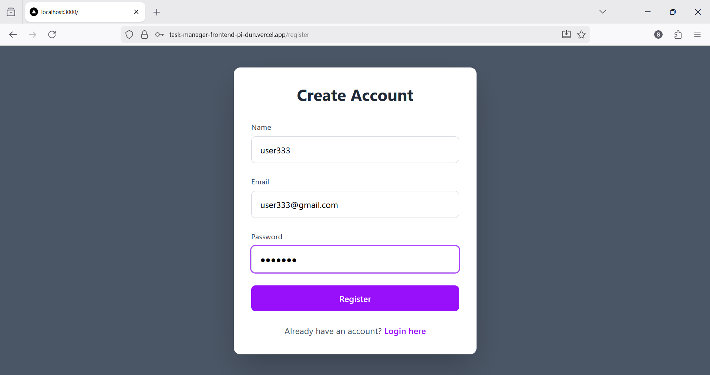
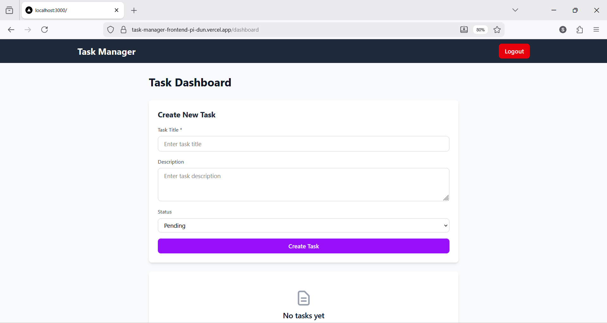
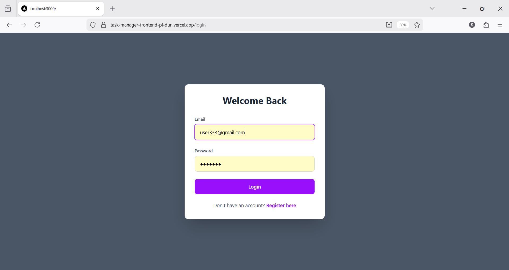
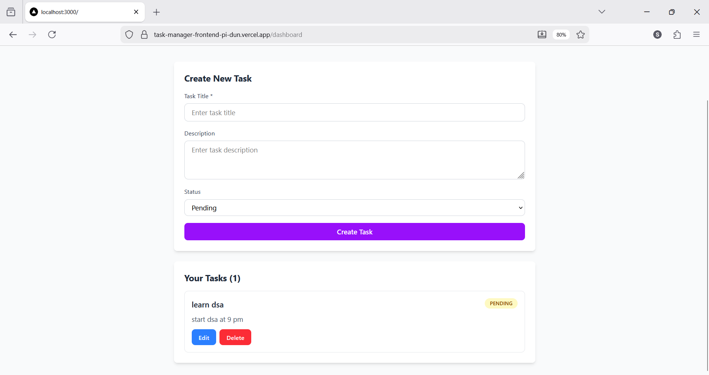

# 📌 Tasks management Project Assignment

This project is a **Scalable REST API with Authentication & Role-Based Access Control**, along with a **basic frontend UI** to interact with the APIs.

The goal of this assignment is to demonstrate backend fundamentals such as **secure authentication, authorization, CRUD operations, clean architecture, and deployment readiness**, along with a minimal frontend for API consumption.

---

## 🚀 Live Deployment

* **Frontend (Next.js + Tailwind CSS)**
  👉 https://secure-rest-api-auth-rbac.vercel.app/

* **Backend (Node.js + Express + MongoDB)**
  👉 https://secure-rest-api-auth-rbac.onrender.com/

---

## 🛠️ Tech Stack

### Backend

* Node.js
* Express.js
* MongoDB + Mongoose
* JWT Authentication
* bcryptjs (password hashing)
* CORS (secure cross-origin setup)
* Render (deployment)

### Frontend

* Next.js (App Router)
* React.js
* Tailwind CSS (latest version)
* Fetch API (no Axios)
* js-cookie (JWT handling)
* Vercel (deployment)

---

## ✅ Core Features Implemented

### 🔐 Authentication & Authorization

* User Registration
* User Login
* Password hashing using bcrypt
* JWT-based authentication
* Protected routes using middleware
* Role field supported (`user`, `admin`)

### 📦 Task Management (CRUD)

* Create Task
* Read All Tasks (user-specific)
* Read Task by ID
* Update Task
* Delete Task

Each task is **securely scoped to the logged-in user**.

---

## 🌐 API Endpoints

### Auth Routes

```
POST   /api/auth/register   → Register user
POST   /api/auth/login      → Login user
GET    /api/auth/me         → Get current user (JWT protected)
```

### Task Routes (JWT Protected)

```
POST   /api/task            → Create task
GET    /api/task            → Get all tasks
GET    /api/task/:id        → Get task by ID
PUT    /api/task/:id        → Update task
DELETE /api/task/:id        → Delete task
```

---

## 🖥️ Frontend Features

* Register new user
* Login existing user
* JWT-based protected dashboard
* Create, update, delete tasks
* Real-time UI updates
* Error & success message handling
* Logout functionality

---

## 🔒 Security Practices

* Password hashing (bcrypt)
* JWT signed with secret & expiry
* Authorization middleware
* Input validation (frontend + backend)
* Secure CORS configuration
* Tokens sent via `Authorization: Bearer <token>` header

---

## 📸 Screenshots









---

## 📄 Environment Variables

### Backend (`.env`)

```
PORT=5000
MONGODB_URI=your_mongodb_connection_string
JWT_SECRET=your_secret_key
```

### Frontend (Vercel)

```
NEXT_PUBLIC_API_URL=https://task-api-backend-2mmo.onrender.com/api
```

---

## 📈 Scalability Notes

* Modular route & controller structure
* Easily extensible for new entities
* JWT-based stateless authentication
* Ready for:

  * Redis caching
  * Microservices
  * Docker containerization
  * Load balancing

---

## 📬 Submission

This project is submitted as part of the **Backend Developer Intern Assignment**.

All required features, security practices, and deployment steps have been implemented successfully.

---

## 👤 Author

**Sufal Thakre**
Backend Developer Intern Candidate

---

⭐ If you like this project, feel free to star the repository!
